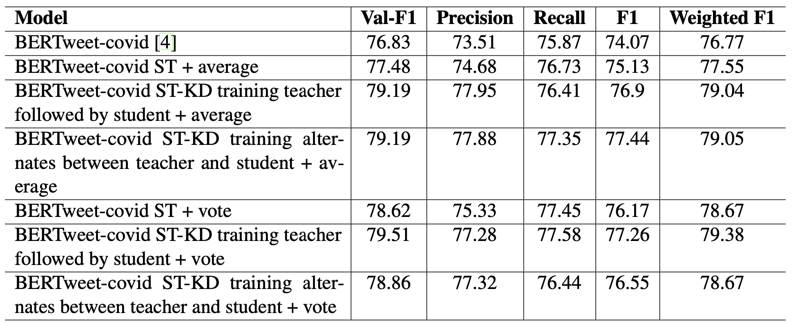

# 1 Introduction

The COVID-19 pandemic has been a global crisis that has affected people of all backgrounds, but some communities have been profoundly impacted by the pandemic. Low-income households, in particular, have faced numerous challenges, from the risk of infection due to poor living conditions to job losses due to lockdown measures. These challenges have been compounded by preexisting health issues, limited access to proper healthcare, and difficulty affording basic necessities like food, rent, and utilities.

Moreover, a report from the August 2022 survey has indicated that some groups such as females, transgender individuals, Hispanics, and those without a high school degree, are more likely to experience long COVID, a condition where symptoms persist long after the initial infection has cleared. The rate of self-reported long COVID cases among the above-mentioned groups was 25%-30% higher than those reported globally for all adults.

To address these challenges during the pandemic, it is essential to have tools that can monitor the impact of a pandemic on these communities in real-time. One such tool is the 2-1-1 helpline, which provides information about social services such as food assistance, housing support, and mental health resources. Studies of the 2-1-1 helpline data of over 3.5 million requests have indicated that the needs of low-income communities vary greatly across different regions and demographic groups. However, most social needs, apart from unemployment claims, are not systematically monitored by the government in real-time, making it difficult for local government agencies to respond effectively to the needs of their communities.

While these new tools and strategies show promise, there are also limitations to survey-based research. Surveys can be expensive and time-consuming to conduct, which makes it difficult for local agencies to monitor the impact of the pandemic on their communities. Furthermore, national agencies may stop tracking the impact of the pandemic at some point, which can limit our ability to prepare for future health crises. Despite these challenges, it is crucial that we continue to develop new tools and strategies for monitoring the impact of the pandemic on low-income communities to ensure that our response is effective.

To address this, Khanal et al. (2021) explored new tools and strategies for monitoring the impacts of the pandemic. Towards this goal, social media has been recognized as a potential real-time source of data for studying and analyzing the impact of the pandemic on low-income communities.

## 1.1 Motivation and Evidence

While survey data is a valuable tool for studying the impact of the COVID-19 pandemic on low-income communities, it suffers from delays that prevent it from providing a real-time indicator of the impact suffered by low-income communities. To address the problem, additional sources of data and information such as social media are being explored as a potential tool. Social media has become a crucial communication tool during the pandemic, as people turned to it to stay connected with family and friends and express their thought and feelings. As a result, social media data can provide a more nuanced understanding of the impact of a pandemic. This can help researchers gain a deeper understanding of the complex and varied impact of the pandemic on low-income communities.

However, collecting and analyzing social media data is not without challenges. One of the biggest challenges is the sheer volume of data available on social media making it difficult to identify relevant data in a time-effective manner, along with noisy and irrelevant or misleading information.

To address these challenges researchers are developing automated tools and algorithms to help identify relevant social media data. Some researchers develop machine learning algorithms and natural language processing techniques that can analyze the impact, identify emerging needs, and come up with strategies to help in real-time. By doing so, these tools can help researchers and policymakers stay informed about the latest developments and respond more effectively to the needs of impacted communities.

## 1.2 Project Goal

Many studies have focused on analyzing social media data related to COVID-19 pandemic, concerning areas such as sentiment analysis, stance detection, and identifying misinformation. However research focused on analyzing the social media data related to the impact of COVID-19 pandemic has been limited, with some notable exceptions.

One such study involved crawling millions of COVID-19-related tweets and manually annotating a small subset of them that best-represented information relevant to low-income households in 16 categories. The annotated tweets were then used to train supervised models based on BERT, a popular language model. While this approach achieved good performance, it only made use of a small subset of the crawled data, leaving a large amount of unlabeled data untapped.

To address this, we pursued training a semi-supervised BERT-based model that could leverage both the labeled and unlabeled data to potentially improve the performance of the supervised model for identifying tweets relevant to low-income households, without the need to manually annotate more data. We employed two different strategies for this purpose: Self-Training and Knowledge Distillation.

Self-Training involves first training a supervised teacher model on the labeled data, and then using the teacher model to assign "hard" pseudo-labels to the unlabeled data. We then select a subset of the pseudo-labeled data and combine it with the labeled data to train a student model. This process can be iterated for multiple rounds, but the student model may suffer performance loss over time if the pseudo-labeled data is not carefully chosen or if the labels are noisy.

Knowledge Distillation, on the other hand, involves using "soft" labels that correspond to the predicted distribution of the unlabeled data. The student model is trained on altering between two objectives: 1) minimizing the cross-entropy loss on the labeled data, and 2) minimizing the cross-entropy loss between the student and teacher-predicted "soft" labels on the unlabeled data.

To summarize, we built semi-supervised BERT models with Self-Training and Knowledge Distilla- tion to better leverage unlabeled data and improve the performance of the supervised BERT model for automatically classifying COVID-19 tweets relevant to low-income households. Our experiment demonstrated that the semi-supervised BERT model and knowledge distillation performed slightly better than the supervised model. These methods have the potential to contribute to the develop- ment of more accurate and effective tools for tracking and monitoring the impact of public health crises such as the COVID-19 pandemic, particularly for understanding their effects on vulnerable communities.

# 1.3 Roadmap Paragraph

“The following is the outline of the paper. We begin by examining relevant work in Section 2. In particular, we examine the use of tools like surveys, help-line and use of social-media by researchers to understand sentiment and stance of people with respect to social media. We also discussed the different techniques that are used in the study and related work with respect to them. We then provide an overall description of the project in Section 3 as well as the architecture of the of the models that are used in the study along with different training and selection techniques. We also discuss the data collected to train the model along with how the data was labeled. Section 4 we discuss the experiment setup along with the questions we are trying to find answers to through this study. We also discuss the results in Section and examine the accuracy of the models along with how well the models generalizes. Section 5 examines areas for future work. Finally, in Section 6, we summarize the results of the paper and discuss future areas of improvement.”

# 2 Related Work

There are many recent works on COVID-19 data analysis tasks, while semi-supervised transformer- based models with Self-Training or Knowledge Distillation have been extensively studied for computer vision and NLP tasks. Given the vast literature on these relevant topics, in what follows, we review papers most closely related to our work.

##2.1 COVID-19 Social Media Data Analysis

Many recent studies have focused on collecting COVID-19 social media data, performing content analysis such as stance detection, sentiment analysis, miss information detection and/or automated data analysis using machine learning models. For example, to help emergency services identify risk behaviors, as a means to estimate public mobility with assumptions that mobility reduced risk-averse behavior Senarath et al. (2021) partnered with practitioners to collect and label a dataset of COVID-19 tweets with respect to risk behaviors such as risk-presenting, risk-taking, etc and proposed a machine learning classifier model using lexical and semantic features to classify tweets with respect to behaviors. Imran et al. (2021) presented a TBCOV, a large-scale Twitter dataset comprising more than two billion multilingual COVID-19 tweets collected worldwide over a period of one year. Several deep learning models were used to enrich the data with sentiment labels, named-entities, geolocation and user’s gender transformation. Chauhan and Hughes (2021) studied Crisis Named Resources (CNRs) created around COVID-19 on Facebook, Twitter, and Reddit. They analyzed when these resources were created and why, and also how CNR owners attempt to manage content and combat misinformation. Other works used COVID-19 social media data and machine learning for categorization, summarization, sentiment analysis and topic modeling tasks. Most of the survey and studies done for understanding the impact of COVID-19 pandemic on low-income household focus more on social and economic aspect of the impact and having limited resources have their survey and studies stopped after a few months. One of the study showed that there were around 3.5 million 2-1-1 request made but there was not enough data to track the requests and understand the impacts COVID-19 had had on the community making this request. There have been many studies published understanding the sentiment with regards to covid-19 pandemic. Despite such great efforts, limited research has been performed to understand the impacts of COVID-19 pandemic on low-income households through social media data analysis. Most notable, Khanal et al. (2021) crawled millions of COVID-19 tweets, used content analysis to annotate a small subset of them with respect to information relevant to low-income households, and finally built a supervised model based on BERT to automatically identify tweets in 16 categories well-represented in the manually annotated data. The resulting model achieved good performance, without making use of the large amount of unlabeled data readily available. It is of interest to explore semi-supervised approaches that can make use of readily available unlabeled data to potentially improve the results of the supervised models.

## 2.2 Self-Training

Based on a simple and intuitive idea, Self-Training has been successfully used in many computer vision and NLP tasks Yarowsky 1995, Pise and Kulkarni 2008, Ouali et al. 2020, Zhai et al. 2019. Self-Training has also been used together with BERT for crisis tweets classification tasks in the context of crisis management. For example, Li et al. (2021) proposed to apply Self-Training with BERT models as base learners to improve performance on domain adaptation tasks where only unlabeled data was available for a target disaster, but labeled data was available for other similar source disasters. They showed that Self-Training could improve the BERT models when the amount of unlabeled data used was relatively large.

## 2.3 Knowledge Distillation

Hinton et al. (2015) first proposed Knowledge Distillation to compress the knowledge in an ensemble model into a single model for deployment. The conventional approach to Knowledge Distillation involves training a smaller student model to replicate the class probability distributions produced by a larger teacher model. However, recent research has delved into an alternative technique called self-distillation Furlanello et al. (2018); Clark et al. (2019); Zhang and Sabuncu (2020), where both the teacher and student models possess identical architectures, essentially functioning as a form of semi-supervised learning. Chen et al. (2021) applied both Self-Training and Knowledge Distillation along with two other semi-supervised learning approaches on Natural Language Understanding tasks (specifically, Intent Classification and Name Entity Recognition). Using a complex data selection procedure and a long short-term memory (LSTM) network as the base learner, they showed that all four semi-supervised approaches reduced the error of the base LSTM model on the tasks considered. Our proposed semi-supervised framework is similar to the framework used by Chen et al. (2021), except that we employed a simpler data selection procedure and replaced the LSTM model with the state-of-the-art BERT model as the base learner. In another closely related work, Zhao and Caragea (2021) used a self-distillation approach with BERT as the base model to learn tag representations for images and subsequently used the tag representations to improve tag-based image privacy prediction. They showed that with only 20% of the annotated data and fine-tuning of the weights associated with the two Knowledge Distillation objectives, the semi-supervised self-distillation approach could achieve performance similar to that of its supervised learning counterpart. Our Knowledge Distillation with BERT approach is very similar to the approach used by Zhao and Caragea (2021) , except that we equally weighted the two objectives of Knowledge Distillation to simplify the training process.

# 3 Experiment setup and Results 

## 3.1 Experiment setup

To compare our semi-supervised BERT model with the supervised model in Khanal et al. (2021), we first reproduced the best supervised model reported in the study. Specifically, we trained a BERTweet-covid model (using a BERT model pre-trained on COVID-19 tweets) that has similar performance as reported in the study Khanal et al. (2021), and used it to establish a baseline for our model. The experiment performed would answer the following questions:

• How does the semi-supervised BERT model with Self-Training compare to the baseline model?

• How does the semi-supervised BERT model with Self-Training and Knowledge Distillation compare to the baseline model?

• How does selection by vote affect the performance of the semi-supervised BERT model?

• How does selection by average affect the performance of the semi-supervised BERT model?

• How does adding more labeled training data affect the performance of the semi-supervised BERT model?

More concretely, we trained and compared the following models:

• BERTweet-covid (baseline): This is the model we built by reproducing the results in Khanal et al. (2021). The model is based on a BERT language model originally pre-trained on tweets Nguyen et al. (2020) and further pre-trained with tweets collected during the COVID-19 pandemic. We trained the model with a batch size of 16, a learning rate of 1e-5, 10 epochs, and callbacks with respect to the best weighted average F1 score on the validation set. We selected the model that had the closest performance to that reported in Khanal et al. (2021). This model serves both as our baseline and as the teacher model for the semi-supervised models.

• BERTweet-covid ST: This is the semi-supervised model trained with the ST strategy. Specifically, we used the BERTweet-covid as the teacher model, selected the top 500 most confident hard pseudo-labeled tweets for each class (2500 in tweets in total for 5 classes), and combined them with the originally labeled tweets to train the student model. We also explored selecting the top 100/200 most confident tweets, and the model seemed to perform similarly. More careful selection techniques should be explored in future work. We used the same hyper-parameters as for the base BERTweet-covid model, and ran each experiment 5 times with 5 different random seeds. The results for each run and the average results of the 5 runs are reported. We will introduce selection by average and selection by voting to select the best tweets for self-training for training in the next epoch. For selection by average, we will take the average of prediction made by the pre-trained models for each each class and select the best tweets to combine with the training dataset and train the model again. Similarly for selection by vote, we will take the of prediction made by the pre-trained models for each class and convert them into a 0/1 vote (class with highest perdiction value will get 1 vote, remaining classes will get 0) to select the best tweets to combine with the training dataset and train the model again. Selection by vote and selection by average are shown using + vote and + average notation in the result tables.

• BERTweet-covid ST KD: This is the semi-supervised model trained with the KD technique by alternating between the two KD objectives described in the Methods section. As for BERTweet-covid ST, we used BERTweet-covid as the teacher model to soft-label the 19,591 unlabeled tweets with predicted probability distributions. We used a batch size of 16 for labeled data, 32 for soft-labeled unlabeled data and trained the model for 5 epochs with callbacks similar to those used for BERTweet-covid ST. We should note that in KD, a temperature T can be applied in the softmax function to smooth the teacher’s predicted probability distribution so that the tweets won’t be assigned a probability distribution with a value close to 1 for one class and close to 0 for other classes. In our experiments, T was set 1. We also experimented with a value of 10 for T , but the results were not much different.

More extended experiments are needed to see how the T value affects the model. We ran each experiment 5 times and reported results for each run and also average results. We will be performing knowledge distillation in two way and comparing their results with each other. In first, we will train the teacher first before distilling its knowledge to the student. In second case, we will train the teacher and distill the knowledge gained to the student simultaneously. We will first train the teacher for one epoch and distill the knowledge to the student. Then we will train the teacher for two epoch and distill the knowledge to the student and Then we will train the teacher for three epoch and distill the knowledge to the student completing five epochs.

## 3.2 Results

The given data is about the performance of different models based on their precision, recall, F1 score, and weighted F1 score, with results averaged over 5 runs. The data is presented in four different tables, each presenting the results of BERTweet-covid, BERTweet-covid ST, and BERTweet-covid ST-KD models with different selection methods for self-training and different knowledge distillation method. The impact of adding additional labeled tweets to the training data is also shown in the table below.

The results of Table 3 shows that in selection by average BERTweet-covid ST-KD with training teacher followed by student had a higher weighted F1 score of 79.73 which is averaged over 5 runs as compared to the baseline model. The model with training teacher followed by student performed better when compared to BERTweet-covid ST and baseline BERTweet-COVID. Both precision and recall have similar results which is 78.53 and 78.44 respectively. If we use the selection by vote method BERTweet-covid ST-KD using alternating knowledge distillation has higher F1 score and training method with training teacher model followed by student model following close by. The results also shows that in selection by average BERTweet-covid ST-KD with training alternates between teacher and student had a higher weighted F1 score of 79.49 which is averaged over 5 runs as compared to the baseline model. The model with training alternates between teacher and student also performed better when compared to BERTweet-covid ST and baseline BERTweet-COVID. From this we can conclude that BERTweet-covid ST-KD performs better than the baseline model with both selection by voting and selection by average using both knowledge distillation training methods.

By analyzing table 4, we can say that adding additional labeled tweet data slight increase in performance in most of the metrics. We can also deduce that selection by voting is performing slightly better than selection by average. We are able to see similar or improved results for recall as well as precision during this experiment. The BERTweet-covid ST-KD model with teacher model training followed by training student model with selection by vote has the best performance amongst all the compared models with 79.38. It is also better than the model trained with no new data. But the same cannot be said for other models as they have provided mixed results where they performed better in few metrics against the similar model with no additional data and sometime perform worst.

Table: Results: Macro Precision, Recall, F1 score and Weighted F1 score of different models. Results are averaged over 5 runs for BERTweet-covid ST and BERTweet-covid ST-KD models with selection of tweets for self-training using selection by average and selection by vote methods.

Table: Results: Macro Precision, Recall, F1 score and Weighted F1 score of different models. Results are averaged over 5 runs for BERTweet-covid ST and BERTweet-covid ST-KD models with selection of tweets for self-training using selection by average and selection by vote methods with additional labeled tweets added to the training set.

The tables show that the BERTweet-covid model with self-training (selection by average) and knowledge distillation (training teacher followed by student) achieved the highest F1 score overall, but the self-training and self-training with knowledge distillation methods were able to slightly improve performance in most cases over the baseline BERTweet-covid model, especially when additional labeled data was used. If the teacher model starts with a noisy mini-batch of tweets, that will make its predication more prone to errors and the teacher will bring in even more noise. It is worth noting that data selection strategies like selection by average and selection by voting helped improve the BERTweet-covid ST-KD model. One could train multiple teachers and filter out noisy data by using a cross-entropy loss of the teachers’ predicted probability distributions for the unlabeled data points, or even use a simple threshold-based selection approach.The results suggest that self-training with knowledge distillation can be a useful technique for improving performance on this task. Fine-tuning the hyper-parameters of the models may also help improve the performance.
