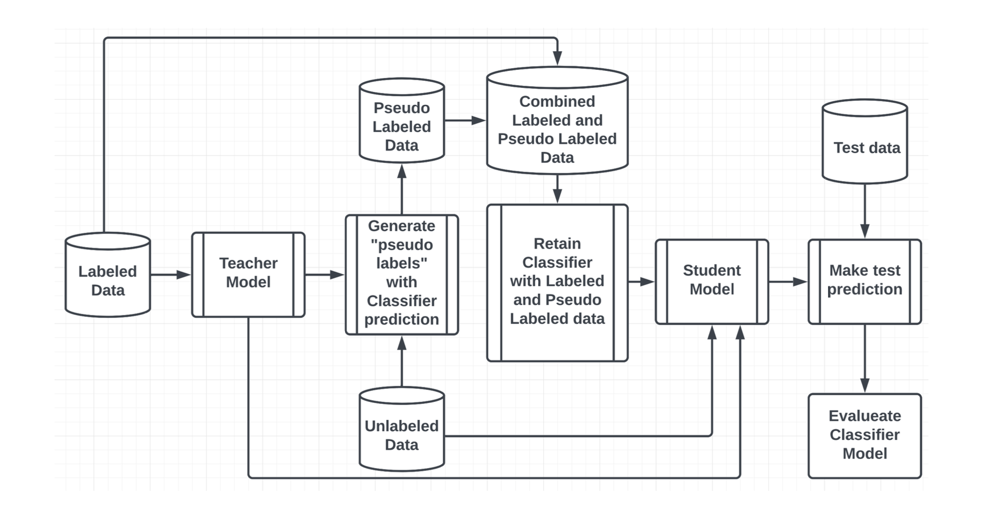
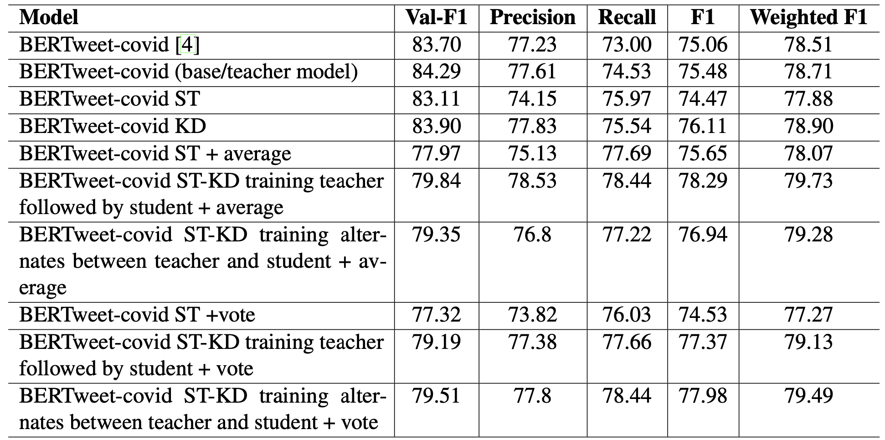

# Introduction

The COVID-19 pandemic disproportionately impacted low-income communities, exposing pre-existing health and social disparities. Traditional survey methods to assess these impacts are slow and expensive. To address this gap, we are exploring social media as a real-time data source.

Social media use boomed during the pandemic as people turned to it to connect and share experiences. This data can provide valuable insights into how low-income communities were affected. However, the vast amount of data and the presence of misleading information pose challenges. Researchers are developing tools to filter relevant data and identify trends using machine learning and natural language processing.

This project aimed to improve the identification of social media posts relevant to low-income communities during COVID-19. We built semi-supervised models to leverage both labeled and unlabeled data, achieving better performance than traditional supervised models using self-training abd knowledge distillation. These methods can contribute to developing real-time tools for monitoring the impact of future public health crises on vulnerable communities.

Figure: This figure shows how self-training abd knowledge distillation in neural network takes place.

#### To learn more about it please read the report available in the GitHub repository.

# Results 

The given data is about the performance of different models based on their precision, recall, F1 score, and weighted F1 score, with results averaged over 5 runs. The data is presented in four different tables, each presenting the results of BERTweet-covid, BERTweet-covid ST, and BERTweet-covid ST-KD models with different selection methods for self-training and different knowledge distillation method. The impact of adding additional labeled tweets to the training data is also shown in the table below.

Table: Results: Macro Precision, Recall, F1 score and Weighted F1 score of different models. Results are averaged over 5 runs for BERTweet-covid ST and BERTweet-covid ST-KD models with selection of tweets for self-training using selection by average and selection by vote methods.

The results of Table 1 shows that in selection by average BERTweet-covid ST-KD with training teacher followed by student had a higher weighted F1 score of 79.73 which is averaged over 5 runs as compared to the baseline model. The model with training teacher followed by student performed better when compared to BERTweet-covid ST and baseline BERTweet-COVID. Both precision and recall have similar results which is 78.53 and 78.44 respectively. If we use the selection by vote method BERTweet-covid ST-KD using alternating knowledge distillation has higher F1 score and training method with training teacher model followed by student model following close by. The results also shows that in selection by average BERTweet-covid ST-KD with training alternates between teacher and student had a higher weighted F1 score of 79.49 which is averaged over 5 runs as compared to the baseline model. The model with training alternates between teacher and student also performed better when compared to BERTweet-covid ST and baseline BERTweet-COVID. From this we can conclude that BERTweet-covid ST-KD performs better than the baseline model with both selection by voting and selection by average using both knowledge distillation training methods.

Table: Results: Macro Precision, Recall, F1 score and Weighted F1 score of different models. Results are averaged over 5 runs for BERTweet-covid ST and BERTweet-covid ST-KD models with selection of tweets for self-training using selection by average and selection by vote methods with additional labeled tweets added to the training set.

By analyzing table 2, we can say that adding additional labeled tweet data slight increase in performance in most of the metrics. We can also deduce that selection by voting is performing slightly better than selection by average. We are able to see similar or improved results for recall as well as precision during this experiment. The BERTweet-covid ST-KD model with teacher model training followed by training student model with selection by vote has the best performance amongst all the compared models with 79.38. It is also better than the model trained with no new data. But the same cannot be said for other models as they have provided mixed results where they performed better in few metrics against the similar model with no additional data and sometime perform worst.

The tables show that the BERTweet-covid model with self-training (selection by average) and knowledge distillation (training teacher followed by student) achieved the highest F1 score overall, but the self-training and self-training with knowledge distillation methods were able to slightly improve performance in most cases over the baseline BERTweet-covid model, especially when additional labeled data was used. If the teacher model starts with a noisy mini-batch of tweets, that will make its predication more prone to errors and the teacher will bring in even more noise. It is worth noting that data selection strategies like selection by average and selection by voting helped improve the BERTweet-covid ST-KD model. One could train multiple teachers and filter out noisy data by using a cross-entropy loss of the teachers’ predicted probability distributions for the unlabeled data points, or even use a simple threshold-based selection approach.The results suggest that self-training with knowledge distillation can be a useful technique for improving performance on this task. Fine-tuning the hyper-parameters of the models may also help improve the performance.
